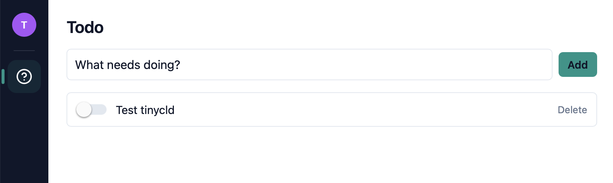

# todo

Simple TODO app for testing tinycld



Feature package for the [tinycld](https://github.com/tinycld/tinycld) ecosystem. Lives as a standalone git repo alongside the [`tinycld`](https://github.com/tinycld/tinycld) app shell and other sibling packages (`contacts`, `mail`, `calendar`, `drive`, `google-takeout-import`). The app shell bundles `@tinycld/core` inside it — there is no separate core repo to clone.

This package was auto-generated to test how well the tinycld documentation is able to be utilized by AI code  assistants. It was _COMPLETELY_ generated using only this prompt:

```
I'm testing the tinycld framework from tinycld.org.

To do so I'd like you to createa stereotypical TODO app.  Read the docs at
https://tinycld.org/llms.txt and create a test package that implements a very 
simple TODO app. the TODO should have the functionality that's typical of test 
apps like this, but in order to test it fully, also generate a golang service
that marks todo's as not completed if their description is modified.
Use the the create-package and accept all defaults.

Work autonomously as much as possible only reporting errors when stuck.
```

## Development

```sh
# Clone the app shell and this package as siblings
cd ~/code/tinycld
git clone git@github.com:tinycld/tinycld.git
git clone git@github.com:tinycld/todo.git

# Install deps in the app shell
cd tinycld
bun install

# Link this package into the app shell
bun run packages:link ../todo

# Run the full stack
bun run dev
```

## Standalone checks

From this directory, with `node_modules` symlinked to `../tinycld/node_modules`:

```sh
ln -s ../tinycld/node_modules node_modules

bun run lint        # biome
```

Typechecking is best done from inside `tinycld/` after this package is linked
in — the app shell's tsconfig pulls in `expo`'s base config, `uniwind` type
augments, and the live `~/types/pbSchema` generated from PocketBase, none of
which a standalone `tsc` invocation in this package can see:

```sh
cd ../tinycld
bun run typecheck
```

## CI

`.github/workflows/ci.yml` runs lint, typecheck, and vitest on every push to
`main` and every PR. It clones `tinycld/tinycld@main` into a sibling
directory, installs the app shell's deps, links this package in, and runs
the checks — exactly what a developer does locally.

## Package anatomy

- `manifest.ts` — the single source of truth for this package's capabilities
- `package.json` — name, exports map, peer deps
- `biome.json`, `tsconfig.json` — lint / typecheck config
- `tests/` — vitest unit tests
