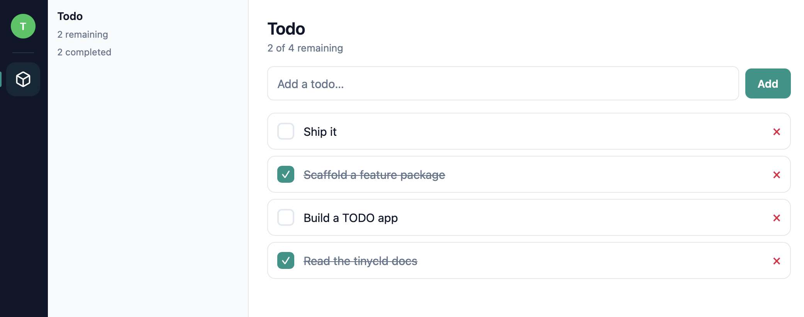

# todo

Todo for your organization



This app was created entirely from the below prompt. It's 
used to judge how accurate our documentation and tooling
is.

> I'm testing the TinyCld framework from tinycld.org.
>
> To do so I'd like you to create a stereotypical TODO app.  Read the docs at
> https://tinycld.org/llms.txt and create a test package that implements a very
> simple TODO app. the TODO should have the functionality that's typical of test
> apps like this, but in order to test it fully, also generate a golang service
> that marks todo's as not completed if their description is modified.
>
> Use the the tinycld bootstrap cli and accept all defaults.
>
> Work autonomously as much as possible only reporting errors when stuck


A feature package for the [tinycld](https://tinycld.org/) ecosystem. It lives in
its own git repo and is developed as a **workspace member** alongside the app
shell (`app`), `@tinycld/core` (its own standalone repo, cloned as a sibling —
not bundled), and the other feature packages.

## Development

The package is one member of a tinycld workspace. To work on it you need a
workspace root containing at least `app`, `core`, and this package as siblings,
linked by a single `pnpm install` at the root.

```sh
# In a fresh workspace directory, clone this package into a member slot…
git clone git@github.com:tinycld/todo.git

# …then assemble the rest of the workspace (app + core + the workspace
# package.json / tinycld.packages.ts). bootstrap --assemble-only skips
# dirs that already exist.
npx @tinycld/bootstrap@latest --assemble-only

# Link every member with one install at the WORKSPACE ROOT (never inside a
# member — siblings have no node_modules of their own; deps hoist to the root).
pnpm install

# Run the full stack (Expo + PocketBase, single-port dev proxy) from the app.
cd app
pnpm run dev
```

## Checks

All checks run **scoped to this member** through `tinycld-pkg`, which reuses the
app shell's biome config, tsconfig base, and vitest/playwright configs (so
`@tinycld/core/*`, uniwind augments, and PocketBase types all resolve):

```sh
cd todo
pnpm exec tinycld-pkg check       # biome + typecheck
pnpm exec tinycld-pkg test        # vitest unit tests
pnpm exec tinycld-pkg test:e2e    # playwright e2e specs (full preset only — packages with screens)
```

There is no `biome.json` in this repo — biome lives only in the app shell and
`tinycld-pkg` points it at this member's source.

## CI

`.github/workflows/ci.yml` runs typecheck, unit tests, and e2e on every push to
`main` and every PR. It checks out this PR's code into a member slot, assembles
the rest of the workspace (`app` + `core` + the workspace `package.json` and
coordination files) via `npx @tinycld/bootstrap --assemble-only`, installs at
the workspace root, and runs `tinycld-pkg check` / `tinycld-pkg test:e2e` —
exactly what a developer runs locally.

## Package anatomy

- `manifest.ts` — the single source of truth for this package's capabilities
- `package.json` — name, exports map, `tinycld-pkg` scripts, peer deps
- `tsconfig.json` — extends the app shell's package tsconfig base
- `vitest.config.ts` (and `playwright.config.ts` — full preset only) — thin configs spreading the app's
- `tinycld/todo/` — the package's TypeScript surface (screens, collections, …)
- `tests/` — vitest unit tests (and Playwright e2e specs — full preset only)
